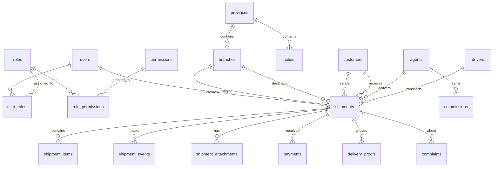

# خطة تنفيذ نظام التوصيل والأمانات اللوجستي

## 1. تحليل الوضع الحالي

### ما لدينا
- وثيقة تحليل ومتطلبات شاملة ([plan.md](file:///c:/Users/tu1/Desktop/محمد%20الوجيه711/plan.md)) تغطي:
  - دورة عمل الشحنة بالكامل (15 خطوة)
  - 9 أدوار مستخدمين مع صلاحياتهم
  - 6 مستويات بيانات عند استلام الشحنة
  - محرك تسعير ذكي
  - نظام تتبع ثنائي المستوى
  - نظام وكلاء خارجيين
  - 30+ جدول قاعدة بيانات
  - خطة تنفيذ من 4 مراحل

### ما ينقص ويحتاج قرار

> [!IMPORTANT]
> ### قرارات تقنية تحتاج موافقتك
> 1. **اختيار التقنية الخلفية**: الوثيقة توصي بـ ASP.NET Core لكنها تذكر NestJS كبديل. **قراري**: سأستخدم **Next.js Full-Stack** (API Routes + Server Actions) بدلاً من فصل الخلفية تماماً — وذلك للأسباب التالية:
>    - تقليل تعقيد المشروع بشكل كبير (stack واحد بدل اثنين)
>    - TypeScript موحد في كل الأماكن
>    - Next.js 15 يدعم Server Components و Server Actions مما يغني عن API منفصل للكثير من العمليات
>    - Prisma ORM مع PostgreSQL يعطي type-safety كامل
>    - أسرع في التطوير وأسهل في النشر
>    - يمكن إضافة API Routes منفصلة لاحقاً عند الحاجة (للوكلاء الخارجيين والتجار)
>
> 2. **الاستضافة**: Vercel + Supabase (PostgreSQL مدار) + Upstash Redis — أو Docker محلي. القرار لك.
>
> 3. **اللغة**: الواجهة ستكون عربية بالكامل (RTL) مع دعم الإنجليزية مستقبلاً.

> [!WARNING]
> ### تغييرات عن الوثيقة الأصلية
> - **لن نستخدم ASP.NET Core** — سنعتمد Next.js Full-Stack لتوحيد التقنية وتسريع التطوير
> - **لن نستخدم SignalR** — سنستخدم Server-Sent Events أو WebSockets المدمجة في Next.js
> - **سنبدأ بـ SQLite/PostgreSQL محلي** مع Prisma ثم الانتقال لـ PostgreSQL مدار عند النشر

---

## 2. القرارات الهندسية الرئيسية

### البنية المعمارية

| القرار | الاختيار | السبب |
|--------|---------|-------|
| البنية العامة | Modular Monolith (كما في الوثيقة) | أسرع في التطوير، أقل تكلفة، قابل للتوسع لاحقاً |
| Framework | Next.js 15 (App Router) | Full-stack، TypeScript، Server Components، SSR/SSG |
| قاعدة البيانات | PostgreSQL | jsonb، partial indexes، partitioning كما توصي الوثيقة |
| ORM | Prisma | Type-safe، migrations تلقائية، دعم ممتاز لـ PostgreSQL |
| المصادقة | NextAuth.js (Auth.js v5) | JWT + Sessions، RBAC، دعم MFA |
| التصميم | Vanilla CSS + CSS Modules | تحكم كامل، أداء عالي، بدون تبعيات خارجية |
| الأيقونات | Lucide React | خفيفة، متسقة، tree-shakable |
| الرسوم البيانية | Recharts | React-native، responsive، متوافقة مع RTL |
| الباركود/QR | qrcode + JsBarcode | طباعة ملصقات مع QR وباركود |
| الحالة | React Context + Server State | بسيط وكافٍ للـ MVP |
| التحقق | Zod | Schema validation في الخادم والعميل |
| الجداول | TanStack Table | فلترة، ترتيب، صفحات، تصدير |

### هيكل الوحدات (Modules)

```
modules/
├── auth/          # المصادقة والتفويض والأدوار
├── shipping/      # الشحنات ودورة حياتها
├── tracking/      # التتبع وسجل الأحداث
├── pricing/       # محرك التسعير الذكي
├── finance/       # المالية والتحصيلات والعمولات
├── agents/        # بوابة الوكلاء
├── customers/     # إدارة العملاء
├── branches/      # الفروع والمحافظات
├── notifications/ # الإشعارات
├── reports/       # التقارير والإحصائيات
├── audit/         # التدقيق والسجلات
└── settings/      # الإعدادات العامة
```

---

## 3. بنية المشروع التفصيلية

```
محمد الوجيه711/
├── plan.md                          # وثيقة المتطلبات الأصلية
├── package.json
├── next.config.js
├── tsconfig.json
├── prisma/
│   ├── schema.prisma               # مخطط قاعدة البيانات
│   ├── seed.ts                     # بيانات أولية
│   └── migrations/                 # سجل الترحيلات
├── public/
│   ├── logo.svg
│   └── fonts/
├── src/
│   ├── app/                        # Next.js App Router
│   │   ├── layout.tsx              # التخطيط الرئيسي (RTL)
│   │   ├── page.tsx                # صفحة الدخول
│   │   ├── globals.css             # المتغيرات والأنماط العامة
│   │   ├── (auth)/                 # مجموعة صفحات المصادقة
│   │   │   ├── login/page.tsx
│   │   │   └── layout.tsx
│   │   ├── (dashboard)/            # لوحة التحكم الرئيسية
│   │   │   ├── layout.tsx          # التخطيط مع القائمة الجانبية
│   │   │   ├── page.tsx            # الصفحة الرئيسية / Dashboard
│   │   │   ├── shipments/          # إدارة الشحنات
│   │   │   │   ├── page.tsx        # قائمة الشحنات
│   │   │   │   ├── new/page.tsx    # إنشاء شحنة جديدة
│   │   │   │   └── [id]/page.tsx   # تفاصيل شحنة
│   │   │   ├── tracking/           # التتبع
│   │   │   ├── customers/          # العملاء
│   │   │   ├── branches/           # الفروع
│   │   │   ├── agents/             # الوكلاء
│   │   │   ├── drivers/            # السائقين
│   │   │   ├── employees/          # الموظفين
│   │   │   ├── pricing/            # التسعير
│   │   │   ├── finance/            # المالية
│   │   │   │   ├── collections/    # التحصيلات
│   │   │   │   ├── expenses/       # المصروفات
│   │   │   │   ├── settlements/    # التسويات
│   │   │   │   └── invoices/       # الفواتير
│   │   │   ├── reports/            # التقارير
│   │   │   ├── complaints/         # الشكاوى
│   │   │   ├── audit/              # التدقيق
│   │   │   └── settings/           # الإعدادات
│   │   ├── (agent)/                # بوابة الوكيل (موبايل)
│   │   │   ├── layout.tsx
│   │   │   └── page.tsx
│   │   ├── (driver)/               # شاشة السائق
│   │   │   ├── layout.tsx
│   │   │   └── page.tsx
│   │   ├── track/                  # صفحة التتبع العامة للعميل
│   │   │   └── page.tsx
│   │   └── api/                    # API Routes
│   │       ├── auth/[...nextauth]/
│   │       ├── shipments/
│   │       ├── tracking/
│   │       └── webhooks/
│   ├── components/                 # المكونات المشتركة
│   │   ├── ui/                     # مكونات UI الأساسية
│   │   │   ├── Button/
│   │   │   ├── Input/
│   │   │   ├── Select/
│   │   │   ├── Modal/
│   │   │   ├── Table/
│   │   │   ├── Card/
│   │   │   ├── Badge/
│   │   │   ├── Toast/
│   │   │   ├── Sidebar/
│   │   │   ├── Header/
│   │   │   └── StatusTimeline/
│   │   ├── forms/                  # نماذج الإدخال
│   │   │   ├── ShipmentForm/
│   │   │   ├── CustomerForm/
│   │   │   └── PricingForm/
│   │   ├── charts/                 # الرسوم البيانية
│   │   │   ├── RevenueChart/
│   │   │   ├── ShipmentStatusChart/
│   │   │   └── PerformanceChart/
│   │   └── labels/                 # طباعة الملصقات
│   │       ├── ShipmentLabel/
│   │       └── BarcodeGenerator/
│   ├── lib/                        # المكتبات والأدوات
│   │   ├── prisma.ts               # Prisma Client
│   │   ├── auth.ts                 # إعدادات المصادقة
│   │   ├── tracking.ts             # توليد أرقام التتبع
│   │   ├── pricing-engine.ts       # محرك التسعير
│   │   ├── validators.ts           # Zod schemas
│   │   └── utils.ts                # أدوات مساعدة
│   ├── hooks/                      # React Hooks مخصصة
│   ├── types/                      # TypeScript types
│   │   ├── shipment.ts
│   │   ├── user.ts
│   │   └── finance.ts
│   └── actions/                    # Server Actions
│       ├── shipment-actions.ts
│       ├── auth-actions.ts
│       ├── finance-actions.ts
│       └── tracking-actions.ts
```

---

## 4. تصميم قاعدة البيانات (الجداول الرئيسية)

سأتبع ما ذكرته الوثيقة مع تحسينات:

### الجداول الأساسية



### تفصيل الجداول المهمة

| الجدول | الحقول الرئيسية | ملاحظات |
|--------|----------------|---------|
| `users` | id, name, email, phone, password_hash, role, branch_id, is_active, avatar | المستخدمون مع ربط بالفرع |
| `shipments` | id, tracking_number, status, type, service_type, sender_id, receiver_id, origin_branch_id, dest_branch_id, agent_id, driver_id, weight, dimensions, declared_value, shipping_fee, collection_amount, payment_method, notes, metadata(jsonb) | الجدول المركزي |
| `shipment_events` | id, shipment_id, event_type, from_user_id, to_user_id, branch_id, location, notes, attachments, created_at | سجل الأحداث الكامل |
| `pricing_rules` | id, name, origin_zone_id, dest_zone_id, base_price, weight_rate, volume_rate, service_multiplier, min_price, is_active | قواعد التسعير |
| `agents` | id, user_id, commission_type, commission_rate, area, status, rating | بيانات الوكيل |
| `payments` | id, shipment_id, amount, type, method, status, collected_by, settled | المدفوعات |
| `audit_logs` | id, user_id, action, entity_type, entity_id, old_values(jsonb), new_values(jsonb), ip_address, created_at | سجل التدقيق |

---

## 5. نظام الصلاحيات (RBAC)

| الدور | الرمز | الصلاحيات الرئيسية |
|------|------|------------------|
| مدير النظام | `SYSTEM_ADMIN` | كل شيء + إعدادات حساسة + إدارة مستخدمين |
| مدير الشركة | `COMPANY_ADMIN` | رؤية شاملة + تقارير + اعتماد سياسات |
| مدير الفرع | `BRANCH_MANAGER` | إدارة فرعه + تقاريره + موظفيه |
| موظف الاستقبال | `RECEPTIONIST` | إنشاء شحنات + طباعة + استلام نقد |
| موظف التسليم | `DELIVERY_STAFF` | شحناته فقط + إثبات تسليم |
| السائق | `DRIVER` | شحنات النقل + تأكيد تحميل/تنزيل |
| الوكيل الخارجي | `AGENT` | شحناته + تحصيل + عمولة |
| العميل | `CUSTOMER` | تتبع شحناته فقط |
| المحاسب | `ACCOUNTANT` | مالية + تسويات + فواتير + تقارير مالية |

---

## 6. تصميم الواجهات

### نظام التصميم (Design System)

- **ألوان**: لوحة ألوان احترافية مستوحاة من:
  - اللون الرئيسي: أزرق داكن (#1e3a5f) — يعكس الثقة والاحترافية
  - اللون الثانوي: أخضر (#10b981) — يعكس النجاح والإنجاز
  - اللون التحذيري: برتقالي (#f59e0b)
  - اللون الخطر: أحمر (#ef4444)
  - خلفية داكنة: (#0f172a)
  - خلفية فاتحة: (#f8fafc)
  - تدرجات glassmorphism
  
- **خطوط**: IBM Plex Sans Arabic (عربي) + Inter (إنجليزي)
- **اتجاه**: RTL بالكامل مع دعم LTR
- **تصميم متجاوب**: Mobile-first

### الواجهات حسب الأولوية (MVP)

#### 1. صفحة تسجيل الدخول
- تصميم أنيق مع glassmorphism
- شعار الشركة + رسالة ترحيبية
- حقول: البريد/الهاتف + كلمة المرور
- "تذكرني" + "نسيت كلمة المرور"

#### 2. لوحة التحكم الرئيسية (Dashboard)
- بطاقات إحصائية (شحنات اليوم، قيد التسليم، مسلّمة، مرتجعة، إيرادات)
- رسم بياني للشحنات (أسبوعي/شهري)
- رسم بياني دائري لتوزيع الحالات
- آخر الشحنات المسجلة
- تنبيهات وإشعارات
- خريطة حرارية للمحافظات (اختياري)

#### 3. إنشاء شحنة جديدة
- نموذج متعدد الخطوات (Wizard):
  - الخطوة 1: بيانات المرسل
  - الخطوة 2: بيانات المستلم
  - الخطوة 3: تفاصيل الشحنة (نوع، وزن، أبعاد، قيمة)
  - الخطوة 4: الخدمة والتسعير (حساب تلقائي)
  - الخطوة 5: المراجعة والتأكيد
- البحث السريع عن عملاء سابقين
- حساب السعر مباشرة أثناء الإدخال

#### 4. قائمة الشحنات
- جدول متقدم مع فلترة وبحث وترتيب
- فلاتر: الحالة، الفرع، التاريخ، الوكيل، المحافظة
- أزرار سريعة: تغيير الحالة، طباعة، تعديل
- تصدير Excel/PDF

#### 5. تفاصيل الشحنة
- معلومات كاملة في بطاقات منظمة
- خط زمني بصري (Timeline) لسجل الأحداث
- المرفقات والصور
- الحالة المالية
- أزرار الإجراءات

#### 6. صفحة التتبع العامة (للعميل)
- بسيطة وأنيقة جداً
- حقل بحث واحد برقم التتبع
- عرض الحالة بخط زمني بصري
- بدون تسجيل دخول

#### 7. شاشة الوكيل (موبايل)
- تصميم Mobile-first
- قائمة المهام اليومية
- استلام/تسليم مع إثبات
- تسجيل التحصيلات
- الرصيد والعمولة

---

## 7. خطة التنفيذ المرحلية

### المرحلة الأولى: الأساس والبنية (MVP) ← **هذا ما سننفذه الآن**

#### الخطوة 1: تأسيس المشروع
- [ ] إنشاء مشروع Next.js 15 مع TypeScript
- [ ] إعداد Prisma مع PostgreSQL
- [ ] بناء نظام التصميم (Design System) — المتغيرات والألوان والخطوط
- [ ] إعداد التخطيط الرئيسي (RTL Layout)

#### الخطوة 2: المصادقة والصلاحيات
- [ ] تسجيل الدخول / الخروج
- [ ] نظام الأدوار (RBAC)
- [ ] حماية المسارات
- [ ] بيانات أولية (Seed) — مستخدم إداري افتراضي

#### الخطوة 3: البنية التحتية للشحنات
- [ ] نموذج قاعدة بيانات الشحنات
- [ ] توليد أرقام التتبع الفريدة
- [ ] نموذج إنشاء شحنة جديدة (Wizard)
- [ ] قائمة الشحنات مع الفلترة والبحث
- [ ] تفاصيل الشحنة مع سجل الأحداث
- [ ] تغيير حالة الشحنة

#### الخطوة 4: لوحة التحكم
- [ ] بطاقات الإحصائيات
- [ ] الرسوم البيانية
- [ ] آخر الشحنات
- [ ] التنبيهات

#### الخطوة 5: إدارة الكيانات الأساسية
- [ ] إدارة الفروع والمحافظات
- [ ] إدارة العملاء (مرسلين/مستلمين)
- [ ] إدارة الموظفين
- [ ] إدارة الوكلاء
- [ ] إدارة السائقين

#### الخطوة 6: التتبع والملصقات
- [ ] صفحة التتبع العامة للعميل
- [ ] طباعة ملصقات الشحن مع QR/Barcode
- [ ] التتبع الداخلي التفصيلي

#### الخطوة 7: التسعير
- [ ] جداول التسعير حسب المناطق
- [ ] محرك حساب السعر التلقائي
- [ ] إدارة قواعد التسعير

#### الخطوة 8: المالية الأساسية
- [ ] تسجيل التحصيلات
- [ ] تسجيل المدفوعات
- [ ] عمولات الوكلاء الأساسية

#### الخطوة 9: شاشة الوكيل
- [ ] واجهة موبايل مخصصة
- [ ] استلام/تسليم الشحنات
- [ ] إثبات التسليم
- [ ] تسجيل التحصيلات

#### الخطوة 10: التقارير الأساسية
- [ ] تقرير الشحنات اليومي
- [ ] تقرير الإيرادات
- [ ] تقرير أداء الوكلاء

---

### المرحلة الثانية: التشغيل الكامل (بعد اعتماد MVP)
- النقل بين المحافظات وإدارة الرحلات
- التسويات المالية الكاملة
- إدارة العهد النقدية
- إثبات التسليم المتقدم (GPS + صور + توقيع)
- إدارة المرتجعات الآلية
- نظام الإشعارات (SMS/Email)
- شاشة السائق
- التقارير المتقدمة
- سجل التدقيق الكامل

### المرحلة الثالثة: التوسع والتميز
- تسعير ذكي AI-assisted
- API عام للتجار
- لوحة عملاء احترافية
- PWA / تطبيق موبايل
- تحليلات متقدمة وتوقعات

---

## 8. خطة التحقق والاختبار

### اختبارات آلية
- `npm run build` — التأكد من بناء المشروع بنجاح
- `npx prisma db push` — التأكد من صحة مخطط قاعدة البيانات
- `npm run lint` — فحص جودة الكود

### تحقق يدوي
- تجربة كل واجهة على مختلف أحجام الشاشات
- اختبار دورة حياة شحنة كاملة
- التأكد من اتجاه RTL في جميع الصفحات
- اختبار الأداء (Lighthouse)

---

## 9. Open Questions

> [!IMPORTANT]
> ### أسئلة تحتاج إجابتك قبل أو أثناء التنفيذ:
> 
> 1. **اسم الشركة وشعارها**: ما اسم شركة التوصيل؟ هل لديك شعار جاهز أم تريد تصميم واحد؟
> 2. **قاعدة البيانات**: هل تفضل SQLite (أبسط للتطوير المحلي) أم PostgreSQL مباشرة؟
> 3. **التقنية الخلفية**: هل توافق على استخدام Next.js Full-Stack بدلاً من ASP.NET Core المذكور في الوثيقة الأصلية؟
> 4. **المحافظات والمناطق**: هل النظام مخصص لبلد معين (اليمن مثلاً)؟ أحتاج قائمة المحافظات والمدن.
> 5. **بيانات تجريبية**: هل تريد بيانات تجريبية جاهزة لتجربة النظام؟
> 6. **الوضع المظلم**: هل تفضل الوضع المظلم أم الفاتح كافتراضي؟ (أقترح المظلم لأنه أكثر احترافية)

---

## 10. ملخص القرارات المتخذة

| # | القرار | السبب |
|---|--------|-------|
| 1 | Next.js Full-Stack بدل ASP.NET Core | توحيد التقنية، سرعة التطوير، TypeScript في كل مكان |
| 2 | Prisma ORM | Type-safety، migrations، دعم PostgreSQL ممتاز |
| 3 | Modular Monolith | كما توصي الوثيقة — أبسط وأسرع للبداية |
| 4 | Vanilla CSS + CSS Modules | تحكم كامل، أداء عالي، تصميم مخصص |
| 5 | App Router | أحدث من Pages Router، Server Components |
| 6 | تنفيذ MVP أولاً | إطلاق سريع ثم توسع تدريجي |
| 7 | RTL-first | النظام عربي بالأساس |
| 8 | Zod للتحقق | موحد بين الخادم والعميل |
